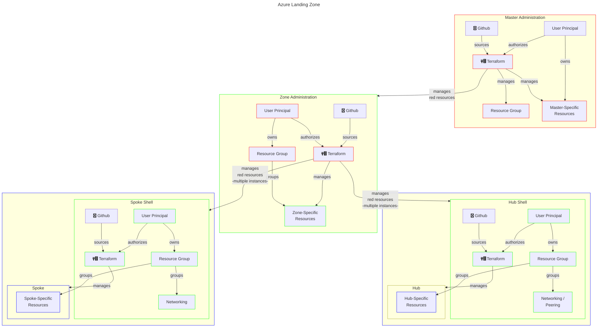

# tf-demo-master
Master Terraform repository for kicking off the demo. Creates `tf-demo-zones`.

```mermaid
---
title: Azure Landing Zone
---
flowchart TD
subgraph master-bootstrap[Master Administration]
    master-source[fa:fa-github Github]
    master-principal[User Principal]
    master-terraform[fa:fa-road-bridge Terraform]:::controlled
    master-resource-group[Resource Group]:::controlled
    master-content[Master-Specific\nResources]:::controlled
    master-source-->|sources|master-terraform
    master-principal-->|authorizes|master-terraform
    master-terraform-->|manages|master-content
    master-terraform-->|manages|master-resource-group
    master-principal-->|owns|master-content
end
subgraph zone-bootstrap[Zone Administration]
    zone-source[fa:fa-github Github]
    zone-principal[User Principal]:::controlled
    zone-terraform[fa:fa-road-bridge Terraform]:::controlled
    zone-resource-group[Resource Group]:::controlled
    zone-content[Zone-Specific\nResources]:::operations
    zone-principal-->|authorizes|zone-terraform
    zone-source-->|sources|zone-terraform
    zone-principal-->|owns|zone-resource-group
    zone-resource-group-->|groups|zone-content
    zone-terraform-->|manages|zone-content
end
subgraph hub-bootstrap[" "]
    subgraph hub-template[Hub Shell]
        hub-source[fa:fa-github Github]
        hub-terraform[fa:fa-road-bridge Terraform]:::operations
        hub-resource-group[Resource Group]:::operations
        hub-principal[User Principal]:::operations
        hub-peerings[Networking /\nPeering]:::operations
        hub-source-->|sources|hub-terraform
        hub-principal-->|authorizes|hub-terraform
        hub-principal-->|owns|hub-resource-group
    end
    subgraph hub[Hub]
        hub-content[Hub-Specific\nResources]:::applications
    end
    hub-resource-group-->|groups|hub-peerings
    hub-resource-group-->|groups|hub-content
end
subgraph hub[Hub]
end
subgraph spoke-bootstrap[" "]
    subgraph spoke-template[Spoke Shell]
        spoke-source[fa:fa-github Github]
        spoke-terraform[fa:fa-road-bridge Terraform]:::operations
        spoke-resource-group[Resource Group]:::operations
        spoke-principal[User Principal]:::operations
        spoke-peerings[Networking]:::operations
        spoke-source-->|sources|spoke-terraform
        spoke-principal-->|authorizes|spoke-terraform
        spoke-principal-->|owns|spoke-resource-group
    end
    subgraph spoke[Spoke]
        spoke-content[Spoke-Specific\nResources]:::applications
    end
    spoke-resource-group-->|groups|spoke-peerings
    spoke-resource-group-->|groups|spoke-content
end

master-terraform-->|manages\nred resources|zone-bootstrap
zone-terraform-->|manages\nred resources\n-multiple instances-|hub-template
zone-terraform-->|manages\nred resources\n-multiple instances-|spoke-template
hub-terraform-->|manages|hub
spoke-terraform-->|manages|spoke

%%linkStyle 3,5 stroke-width:0px
classDef controlled stroke:#f00
classDef operations stroke:#0f0
classDef applications stroke:#00f
class master-bootstrap controlled
class zone-bootstrap operations
class hub-template,spoke-template operations
class hub-bootstrap,hub,spoke-bootstrap,spoke applications

class zone-terraform,zone-resource-group,zone-principal red
class zone-content orange
class hub-terraform,hub-principal orange
class zone-bootstrap,hub-template,spoke-template green
class hub-bootstrap,spoke-bootstrap,hub,spoke blue

```
